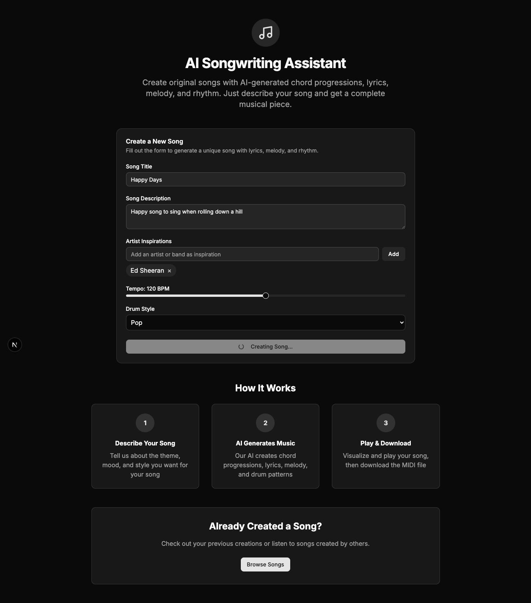
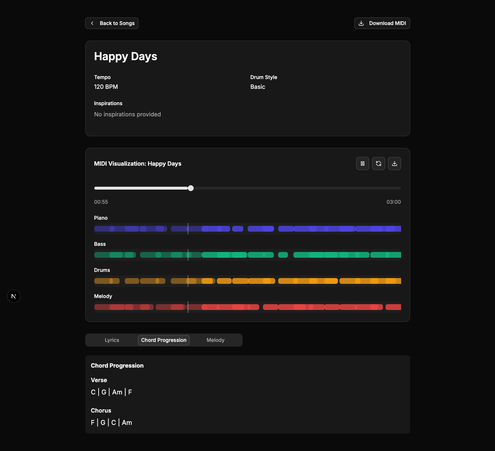

# AI Songwriting Assistant

A comprehensive multi-agent AI system for creating original songs with chord progressions, lyrics, melodies, and instrumental arrangements.



## 🎵 Project Overview

This project combines advanced AI agents with music theory and MIDI orchestration to create original songs based on simple human inputs. Using Azure OpenAI and the AutoGen framework, specialised agents collaborate to handle different aspects of the songwriting process, resulting in complete musical compositions.

[Listen to Happy Days here!](./songs/Happy_Days/Happy_Days.mp3)

## 🤖 Agentic AI System

The core of this system uses an agentic approach where multiple specialised AI agents work together, each handling a specific aspect of the songwriting process:

### Agent Architecture

```
                    ┌─────────────────┐
                    │   Router Agent  │
                    └─────────────────┘
                            │
           ┌────────────────┼────────────────┐
           │                │                │
┌─────────────────┐ ┌─────────────────┐ ┌─────────────────┐
│  Chord Agent    │ │  Lyrics Agent   │ │  Melody Agent   │
└─────────────────┘ └─────────────────┘ └─────────────────┘
           │                │                │
           └────────────────┼────────────────┘
                            │
                    ┌─────────────────┐
                    │   Drum Agent    │
                    └─────────────────┘
                            │
                    ┌─────────────────┐
                    │ Music Processor │
                    └─────────────────┘
```

### Agents and Their Roles

1. **Router Agent**: Delegates user requests to the appropriate specialist agent
2. **Chord Progression Agent**: Creates harmonically coherent chord progressions for verse and chorus
3. **Lyrics Agent**: Generates lyrics that match the mood, theme, and chord structure
4. **Melody Agent**: Composes melodies that align with lyrics and chords
5. **Drum Agent**: Creates appropriate rhythmic patterns in various styles

### Agent Communication

- Agents communicate through a structured protocol using JSON
- Each agent receives context from previous agents' work
- The system maintains a consistent creative direction throughout the process

## 🎹 MIDI Orchestration System

The system integrates several music libraries to create and manipulate MIDI files:

### Core Components

- **Music21**: Python toolkit for computer-aided musicology
- **Mido**: Library for working with MIDI messages and files
- **Custom Music Processor**: Handles the assembly of multi-track MIDI files

### MIDI Generation Process

1. **Chord Analysis**: Translates chord symbols (e.g., "Am", "F") into actual notes
2. **Melody Construction**: Maps syllables to notes with appropriate durations
3. **Drum Pattern Generation**: Creates style-specific drum patterns using GM drum map
4. **Track Assembly**: Combines piano, melody, strings, and drum tracks into a complete arrangement
5. **File Export**: Saves as standard MIDI files that can be imported into any DAW



## 🎼 Music Theory Implementation

The system incorporates music theory principles to create musically coherent compositions:

- **Chord Relationship**: Maintains tonal coherence between verse and chorus
- **Melodic Structure**: Creates motifs and ensures proper resolution of non-chord tones
- **Rhythmic Variations**: Implements different drum styles with appropriate feel
- **Song Structure**: Standard 16-bar structure with 8-bar verse and 8-bar chorus sections

## 🌐 System Architecture

```
┌─────────────────────────────────────────────┐
│                  Frontend                   │
│  (Next.js, React, Tailwind, MIDI Visualiser)│
└───────────────────┬─────────────────────────┘
                    │
                    │ HTTP/REST
                    │
┌───────────────────▼─────────────────────────┐
│                   Backend                   │
│      (FastAPI, AutoGen, Music Libraries)    │
└───────────────────┬─────────────────────────┘
                    │
      ┌─────────────┴─────────────┐
      │                           │
┌─────▼─────┐             ┌───────▼───────┐
│ Azure     │             │  Song Storage │
│ OpenAI    │             │  (MIDI, JSON) │
└───────────┘             └───────────────┘
```

### Key Technical Components

- **Frontend**: Modern Next.js application with interactive MIDI visualisation
- **Backend**: FastAPI server with AutoGen-powered agent system
- **AI**: Azure OpenAI for large language model capabilities
- **Storage**: File-based storage for MIDI files and song metadata

## 🚀 Getting Started

### Prerequisites

- Python 3.9+
- Node.js 18.17.0+
- Azure OpenAI API access

### Installation

1. Clone the repository:
   ```bash
   git clone <repository-url>
   cd ai-songwriting-system
   ```

2. Set up backend:
   ```bash
   cd backend
   # See backend/README.md for detailed setup instructions
   ```

3. Set up frontend:
   ```bash
   cd frontend
   # See frontend/README.md for detailed setup instructions
   ```

## 🧠 How the System Works

### 1. User Input

The process begins with the user providing:
- Song description (theme, mood)
- Musical inspirations (artists, genres)
- Optional parameters (tempo, drum style)

### 2. Agent Collaboration

The system follows this workflow:

1. **Router Agent** analyses the request and delegates to specialists
2. **Chord Agent** generates verse and chorus progressions
3. **Lyrics Agent** creates lyrics with appropriate syllable patterns
4. **Melody Agent** maps notes to lyrics with musical phrasing
5. **Drum Agent** determines the appropriate drum style and pattern

### 3. MIDI Assembly

The Music Processor combines all elements:

1. Creates a multi-track MIDI file with appropriate instruments
2. Adds tempo and time signature information
3. Arranges parts into a coherent song structure
4. Saves metadata and MIDI for future reference

### 4. User Interface

The frontend presents:
- Interactive MIDI visualisation and playback
- Detailed song information (lyrics, chords, structure)
- Download options for MIDI files

## 🔍 Technical Deep Dive

### Syllable-to-Note Mapping

The Melody Agent breaks lyrics into syllables and maps each to appropriate notes:

```python
# Sample conversion of lyrics to melody notes
{
  "pitch": "C4",     # Note pitch (C in 4th octave)
  "duration": 0.5,   # Duration (eighth note)
  "syllable": "sun"  # Corresponding syllable
}
```

### Drum Pattern Generation

Drum patterns are created using the General MIDI drum map with specialised patterns:

```python
# Example of drum pattern generation
DRUM_NOTES = {
  "kick": 36,          # Bass Drum 1
  "snare": 38,         # Acoustic Snare
  "closed_hihat": 42,  # Closed Hi-Hat
  # ...
}

# Pattern creation with timing and velocity information
pattern = [
  (0, DRUM_NOTES["kick"], VELOCITIES["accent"], note_duration),
  (quarter, DRUM_NOTES["snare"], VELOCITIES["normal"], note_duration),
  # ...
]
```

### Chord Progression Analysis

The system analyses chord relationships to ensure musical cohesion:

```python
# Converting chord symbols to actual music theory objects
chord = music21.harmony.ChordSymbol("Am")
notes = chord.pitches  # Gets actual note objects
```

## 📄 License

[MIT License](LICENSE)
